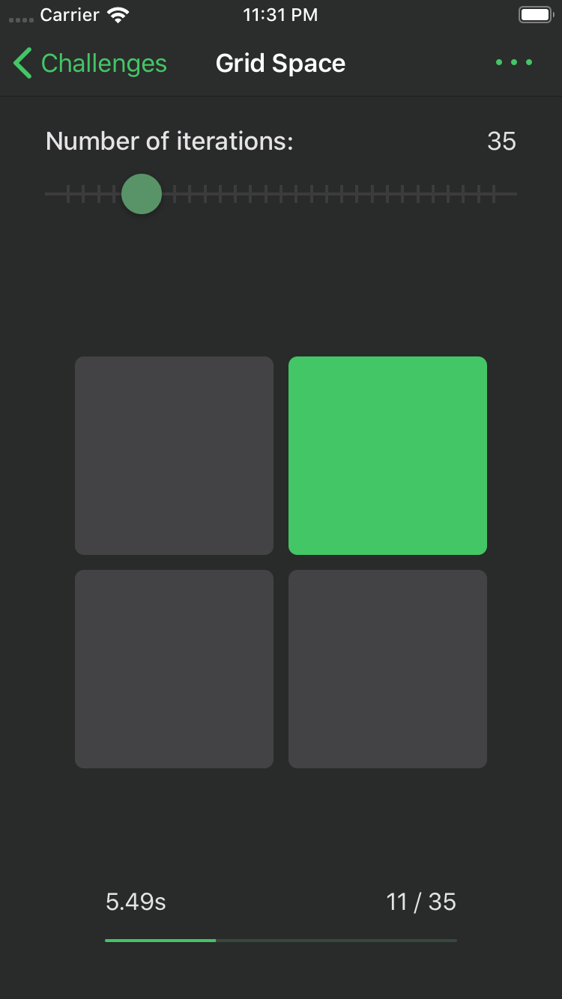
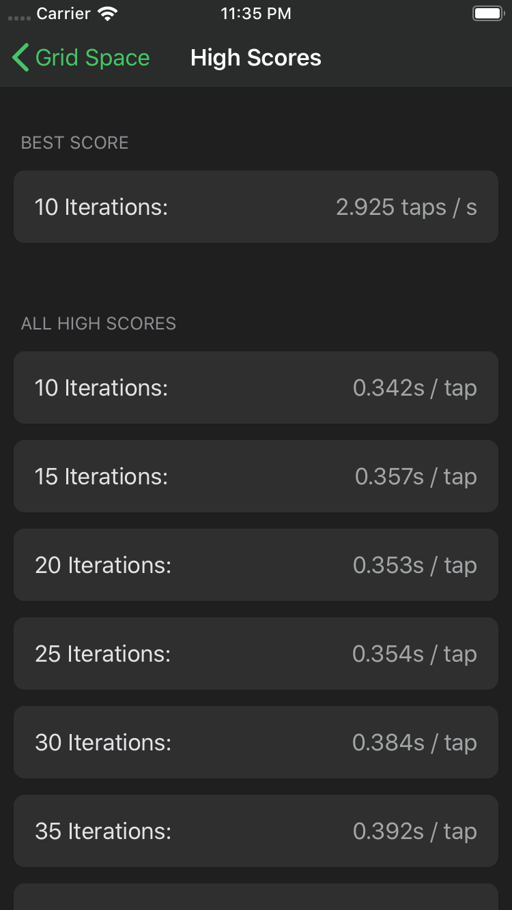
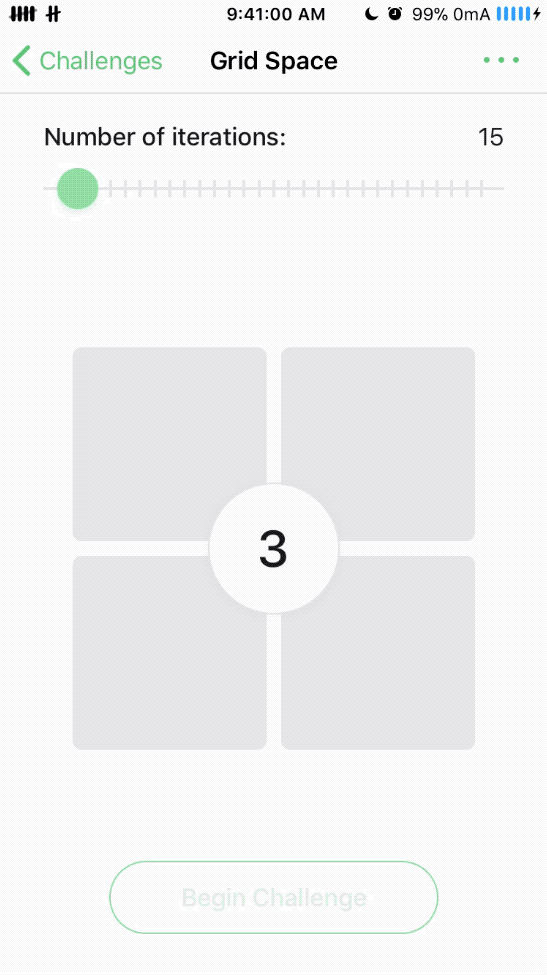

# mind-master
A collection of challenges (games) that can boost one's cognitive capacity. It's the 2nd generation of “Brain Trainer.”

## Current Challenges
- Reaction type challenges
    - Classic
    - Grid space
    - The rules of this game are very simple. When the timer starts, all you need to do is to hit the green square as quick as possible. Accidentally tapping a gray square will result in gameover. Afteryou finish all iterations, you will see your result.
     
    
    
    
    
    
     
    - Color dodge
- Memory recall challenge
    - Digits
    - Letters
    - Both
    Colors
