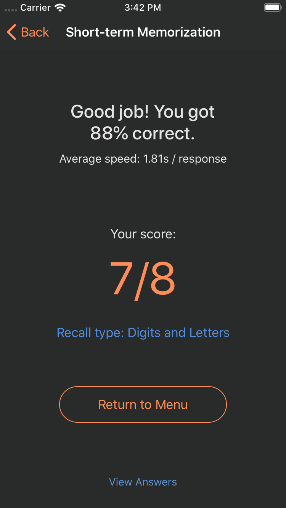
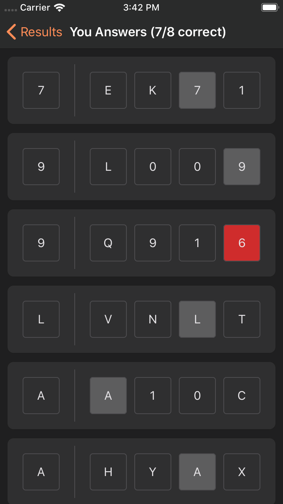
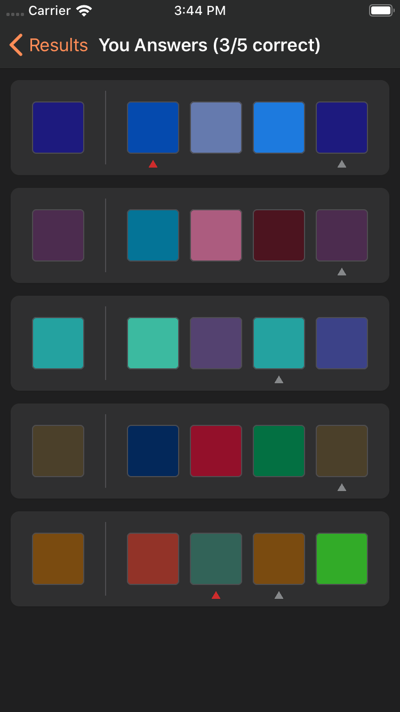
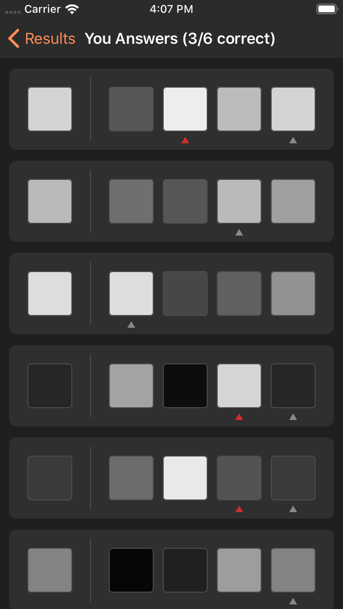

# Mind Master
A collection of challenges (games) that can boost one's cognitive capacity. It's the 2nd generation of “Brain Trainer.”

## Current Challenges
- Reaction type challenges
    - Classic
    - Grid space
    - The rules of this game are very simple. When the timer starts, all you need to do is to hit the green square as quick as possible. Accidentally tapping a gray square will result in gameover. After you finish all iterations, you will see your performance.
     
    
    
    
    
    
     
    
    This game is actually surprisingly difficult to play at first, because we're all so used to patterns, so instead of reacting to every new appearance of the green square (which is computationally expensive for our brain), our brain sometimes subconciously direct our fingers to gray tiles, leading to funny errors.  
    
    - Color dodge
- Memory recall challenge
    - Digits
    - Letters
    - Both
    - Colors. This is perhaps the most uncommon type of recall challenge. We're used to memorizing quantitative information like digits or sequences of letters (e.g. email addresses, phone numbers, etc.) but we rarely memorize something that cannot be described by words. This is perhaps what makes color memorization **more difficult** than the other challenges. Like the other test categories, you will first view a sequence of colors, then asked to recall the colors you've seen from a list of 4 options. The options are similar (although guaranteed all different and differentiated by a certain “granularity” that I configured)! Below is an example of a color displayed during the memorization stage and the same color requested during the recall stage.
     
    
    
    
    
     
    
    After you finish playing a round of the game, you will see your score. You can also review the questions and compare your answers against the correct ones. Both colors and characters are supported.
     
    
    
    

    - Monochrome. This is just a variation of the “color” mode, but this time all the colors are in grayscale. In my opinion this is even harder than have a variety of colors, but I'm sure there are very smart people who can handle this challenge. Here I used the answer screen to show how the colors are generated and displayed.

    
